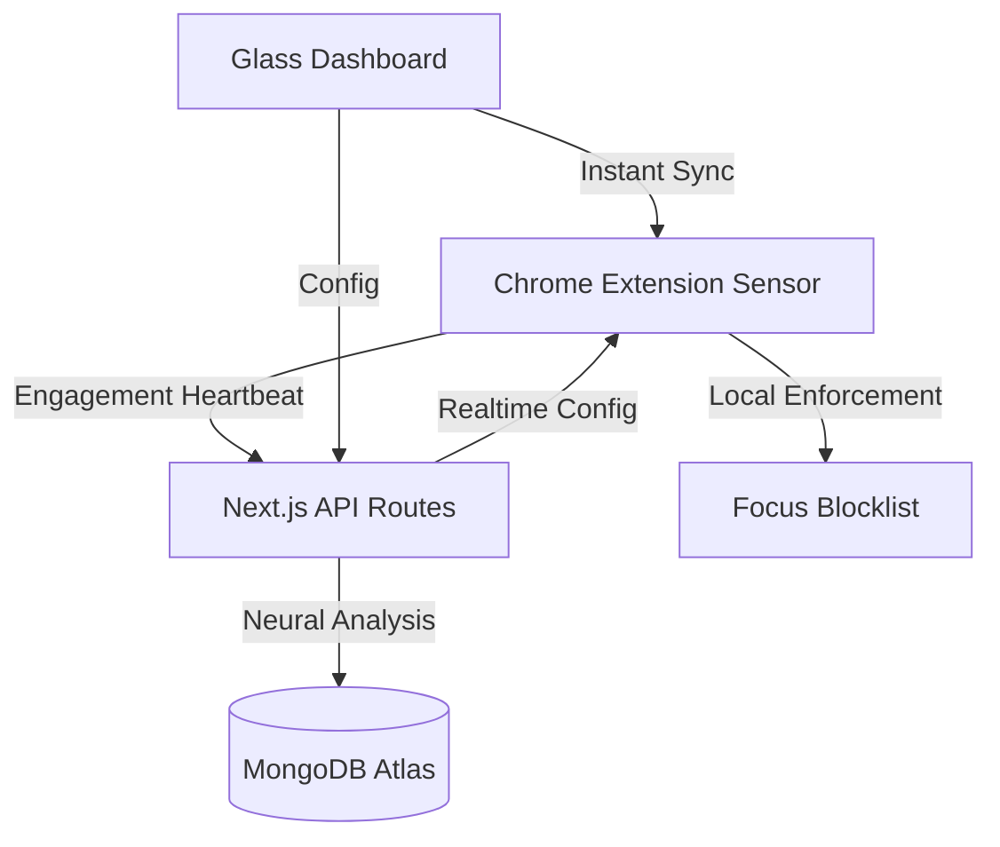

# 🦅 ProdLytics | Neural Optimization Engine

> **Align your digital behavior with your cognitive peak through real-time neural insights.**

**ProdLytics** is a premium, AI-powered productivity ecosystem designed for elite performance. It bridges the gap between raw tracking and actionable intelligence, using a sophisticated **Chrome Extension sensor** and a **Glassmorphic Command Center**.

---

## 🔄 The ProdLytics Philosophy
ProdLytics is built on four core neural pillars:

1.  **Awareness (A)**: High-velocity tracking of every active second. We capture workflow intensity (scrolls, clicks) to distinguish between true deep work and passive engagement.
2.  **Effort (E)**: Our **AI Neural Engine** calculates your **Cognitive Load** and **Neural Intensity** in real-time, visualizing your mental energy through **Heartbeat (ECG) Style Flow Charts**.
3.  **Resilience (R)**: Build deep work stamina with structured **Goals** and a **Focus Intent Timer** that breaks down your primary objective into actionable subtasks.
4.  **Optimization (O)**: **Focus Mode** and **AI Smart Block** act as your digital guardrails, enforcing strict blocks and proactive "nudges" when neural load indicates a focus drop.

---

## ✨ System Highlights

| Feature | Description | Status |
| :--- | :--- | :--- |
| **💓 Heartbeat Flow** | ECG-style D3.js visualization of your neural load. | **ACTIVE** |
| **🧠 AI Smart Block** | Proactive blocking based on real-time site categorization. | **ACTIVE** |
| **📡 Instant Sync** | Zero-latency synchronization between Dashboard and Extension. | **ACTIVE** |
| **🛡️ Focus Guard** | Strict-mode enforcement and manual domain blocklisting. | **ACTIVE** |
| **🚀 Intent Timer** | Goal-oriented Pomodoro with integrated task management. | **ACTIVE** |

---

## 🏗️ Technical Architecture

### **The Neural Feedback Loop**


---

## 🛠️ Tech Stack

- **Command Center**: [Next.js 14](file:///c:/Users/bhata/Downloads/TimeExt/frontend) (App Router, Server Actions, Framer Motion)
- **Neural Sensor**: [Chrome Extension V3](file:///c:/Users/bhata/Downloads/TimeExt/extension) (Manifest V3, Service Workers)
- **Logic Engine**: [Node.js backend](file:///c:/Users/bhata/Downloads/TimeExt/backend) with Mongoose & MongoDB Atlas
- **Visuals**: [D3.js (Heartbeat ECG)](file:///c:/Users/bhata/Downloads/TimeExt/frontend/src/components/D3Charts.jsx) & Lucide Icons

---

## 🚀 Getting Started

### **Prerequisites**
- **Node.js** v20+ 
- A local or Atlas **MongoDB** instance

### **Installation**
1. **Clone the Hub**:
   ```bash
   git clone <repo-url>
   cd TimeExt
   ```
2. **Setup Dashboard**:
   ```bash
   cd frontend
   npm install
   npm run dev
   ```
3. **Load Extension**:
   - Open Chrome -> `chrome://extensions`
   - Enable **Developer Mode**
   - Click **Load Unpacked** and select the `/extension` directory.

---

⭐ **Star ProdLytics to support high-performance open-source!** 🦅
[Developed by ProdLytics Engineering • Built for the Top 1%]
