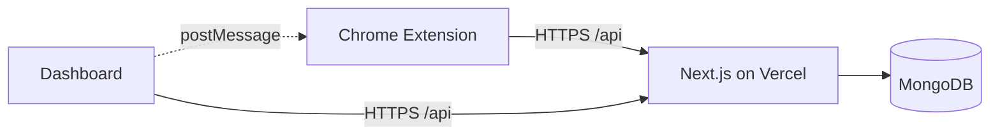

# ProdLytics

ProdLytics is a full-stack productivity platform that combines a **Chrome extension** (Manifest V3), a **Next.js** dashboard, and **MongoDB**. It tracks browsing behavior, classifies activity, computes focus indicators, and provides goals, blocklists, deep-work sessions, and insights.

## Overview

1. **Capture** browsing activity and light interaction signals.
2. **Interpret** behavior using classification and analytics.
3. **Act** with goals, Focus Mode, Timer, and AI-style insights.

## Documentation

| Doc | Description |
|-----|-------------|
| [docs/PROJECT_DOCUMENTATION.md](docs/PROJECT_DOCUMENTATION.md) | Technical details and API notes |
| [docs/SRS.md](docs/SRS.md) | Software Requirements Specification |
| [docs/chrome-web-store/](docs/chrome-web-store/) | Chrome Web Store listing copy, privacy policy mirror, **publish checklist** |
| [docs/chrome-web-store/screenshots/](docs/chrome-web-store/screenshots/) | Store listing screenshots (upload in Developer Dashboard, not in the extension zip) |
| [report.md](report.md) | Project report |

If `docs/SRS.md` shows escaped newlines or broken dashes after a merge:

```bash
python docs/fix_srs_encoding.py
```

## Repository structure

| Directory | Purpose |
|-----------|---------|
| `frontend/` | Next.js 16 app: dashboard UI and **API routes** under `src/app/api/` |
| `backend/` | Shared package (`@prodlytics/backend`): MongoDB connector, Mongoose models, AI classifier — **imported by the Next API**, not a separate deployed server |
| `extension/` | Chrome extension source; production build output in `extension/dist/` |
| `docs/` | Technical docs, SRS, Chrome Web Store materials |

## Architecture



## Tech stack

- **Dashboard / API:** Next.js 16, React 19, Tailwind CSS v4, Framer Motion, D3, Recharts
- **Data:** MongoDB, Mongoose
- **Extension:** Manifest V3, Vite, esbuild

## Prerequisites

- Node.js 20+
- npm 10+
- MongoDB locally or [MongoDB Atlas](https://www.mongodb.com/cloud/atlas)
- Google Chrome (or Chromium)

## Environment variables

Create **`frontend/.env.local`** for local development (never commit secrets).

| Variable | Required | Purpose |
|----------|----------|---------|
| `MONGO_URI` | Yes | MongoDB connection string |
| `JWT_SECRET` | Yes (prod) | Signs session JWTs for API auth |
| `NEXT_PUBLIC_GOOGLE_CLIENT_ID` / `GOOGLE_CLIENT_ID` | If using Google sign-in | OAuth |
| `NEXT_PUBLIC_SUPPORT_EMAIL` | Optional | Shown on `/privacy-policy` (overrides built-in default if set) |
| `NEXT_PUBLIC_DATA_REGION` | Optional | Shown on `/privacy-policy` for data residency text |

On **Vercel**, add the same keys under **Project → Settings → Environment Variables** for Production, then redeploy.

## Quick start

### 1. Install dependencies (repo root)

```bash
npm run install:all
```

### 2. Run the dashboard

```bash
cd frontend
npm run dev
```

Open [http://localhost:3000](http://localhost:3000).

### 3. Build the extension

```bash
cd extension
npm install
npm run build
```

### 4. Load the extension in Chrome

1. Open `chrome://extensions`
2. Enable **Developer mode**
3. Click **Load unpacked**
4. Choose the **`extension/dist`** folder

After code changes, run `npm run build` in `extension/` again and use **Reload** on the extension card.

### 5. Optional: run dashboard + extension dev together

From repo root:

```bash
npm run dev
```

## Root npm scripts

| Script | Description |
|--------|-------------|
| `npm run install:all` | Install dependencies for `extension`, `frontend`, and `backend` |
| `npm run dev` | Run frontend and extension dev servers concurrently |
| `npm run build:ext` | Production build of the extension (`extension/dist`) |

## Extension: Chrome Web Store package

From **`extension/`**:

```bash
npm run build
npm run zip:store
```

This creates **`extension/prodlytics-extension-store.zip`** with `dist/` contents at the zip root (required upload shape for the store). The zip path is listed in `.gitignore`; regenerate before each submission.

Full steps: [docs/chrome-web-store/PUBLISH_CHECKLIST.md](docs/chrome-web-store/PUBLISH_CHECKLIST.md).

## Deployment (Vercel)

The **dashboard and REST API** deploy as a single Next.js app (e.g. to Vercel). The `backend/` folder is bundled into that deployment via API routes — you do **not** deploy `backend/` as a separate host.

Set **`MONGO_URI`**, **`JWT_SECRET`**, and any OAuth variables on Vercel. The production extension build targets **`https://prodlytics.vercel.app`** by default (see `extension/build.js`).

## Verification before release

**Frontend**

```bash
cd frontend
npm run lint
npm run build
```

**Extension**

```bash
cd extension
npm run lint
npm run build
```

Release-ready checklist:

- Lint and production builds succeed for `frontend` and `extension`
- Extension loads from `extension/dist` and syncs with your deployed dashboard URL
- Live `/api/*` responses work with production MongoDB and env vars

## API summary

Handlers live under **`frontend/src/app/api/`**.

- `POST /api/tracking` — ingest browsing and engagement data
- `GET /api/tracking/stats?range=today|yesterday|week|month` — aggregates and score
- `GET /api/tracking/hourly` — hourly breakdown (timezone-aware when client sends `tz` / `dateKey`)
- `GET /api/tracking/cognitive-load` — cognitive-load-style series
- `GET|PUT /api/auth/preferences` — focus/timer preferences
- `GET|POST|PUT|DELETE /api/goals` and `GET /api/goals/progress`
- `GET|POST|DELETE /api/focus` — blocklist
- `GET|POST /api/deepwork` — deep-work sessions

For contracts and schemas, see [docs/PROJECT_DOCUMENTATION.md](docs/PROJECT_DOCUMENTATION.md).

## Troubleshooting

**MongoDB connection fails**

- Confirm `MONGO_URI` in `frontend/.env.local` (local) or Vercel env (production)
- Check Atlas IP allowlist / credentials

**Extension not syncing**

- **Local:** run the dashboard at `http://localhost:3000`, then from `extension/` run `npm run build:dev` (or `PRODLYTICS_EXTENSION_TARGET=development npm run build`) so the bundle targets localhost
- **Production:** default `npm run build` points at `https://prodlytics.vercel.app`; reload the extension after each rebuild

**JWT / auth errors**

- Set `JWT_SECRET` in the same environment as the Next server (Vercel for production)

## Notes for review and demo

- CORS is configured for extension + dashboard origins; tighten for production if you add new frontends.
- Cognitive-style metrics are **heuristic** productivity indicators, not medical diagnostics.

## Contributors

| GitHub |
|--------|
| [@adnaan-dev](https://github.com/adnaan-dev) |
| [@sradha2474](https://github.com/sradha2474) |
| [@akeem786](https://github.com/akeem786) |
| [@saqibmokhtar884](https://github.com/saqibmokhtar884) |
| [@bhataakib02](https://github.com/bhataakib02) |
| [@abhishek-134](https://github.com/abhishek-134) |
| [@satakshik-chaurasia](https://github.com/satakshik-chaurasia) |

## License

Use the repository license file at the project root (for example `LICENSE`) if present.
