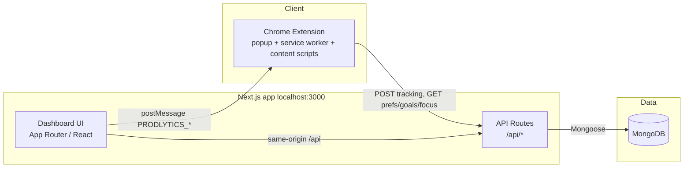

# ProdLytics — Project Documentation

**Version:** As of repository state documented in this file  
**Product name:** ProdLytics (AI productivity platform: dashboard + Chrome extension + MongoDB)

---

## 1. Executive summary

ProdLytics is a **browser-centric productivity system**. A **Chrome extension (Manifest V3)** collects engagement signals (time on site, scrolls, clicks, page title) and sends them to **Next.js API routes**, which persist data in **MongoDB** via **Mongoose**. A **React dashboard** (same Next.js app) visualizes focus scores, site breakdowns, goals, focus blocklists, Pomodoro-style deep-work sessions, and an **AI Insights** view with cognitive-load heuristics and actionable recommendations.

**Design goal:** Close the loop between *measurement* (extension), *interpretation* (rules, aggregates, charts), and *action* (focus mode, timer, goals, sync).

---

## 2. High-level architecture



- **Extension → API:** Tracking batches, blocklist sync, preferences, goals progress (see §5).  
- **Dashboard → Extension:** `window.postMessage` from `frontend/src/lib/extensionSync.js` (e.g. sync blocklist, optional workspace toasts) when the dashboard is open on `http://localhost:3000` or `http://127.0.0.1:3000` (matches `manifest.json` `externally_connectable` and content-script origin rules).

---

## 3. Repository layout

| Path | Role |
|------|------|
| `frontend/` | Next.js 16 app: UI, all `/api/*` route handlers, Tailwind v4, Framer Motion, D3, Recharts |
| `backend/` | Shared package `@prodlytics/backend`: Mongoose models, `db/mongodb.js`, `services/aiClassifier.js` |
| `extension/` | Vite-built MV3 extension; source in `src/`; **load `extension/dist`** in Chrome |
| `docs/` | This documentation |

The frontend imports the backend package (`"@prodlytics/backend": "file:../backend"` in `frontend/package.json`) so API routes can `import` models and `dbConnect` from `backend/`.

---

## 4. Dashboard application (frontend)

### 4.1 Shell

- **Layout:** `frontend/src/app/layout.jsx` — `Sidebar`, `Navbar`, `AuthProvider`, `DashboardProvider`, theme (`next-themes` / `Providers`).
- **Main page:** `frontend/src/app/page.jsx` — single-page dashboard; tab state in `DashboardContext` (`activeTab`: `overview` | `analytics` | `goals` | `focus` | `timer` | `insights` | `setup`).

### 4.2 Views (feature areas)

| Tab ID | Component | Purpose |
|--------|-----------|---------|
| `overview` | `OverviewView.jsx` | Summary metrics, quick orientation |
| `analytics` | `AnalyticsView.jsx` | Deeper charts and domain lists |
| `goals` | `GoalsView.jsx` | CRUD goals; productive-time targets and per-site limits |
| `focus` | `FocusView.jsx` | Neural / manual blocklist (Focus blocks) |
| `timer` | `TimerView.jsx` | Deep-work sessions (Pomodoro-style); posts to `/api/deepwork` |
| `insights` | `InsightsView.jsx` | AI Insights: cognitive load chart, recommendations, tomorrow plan, goals strip, milestones |
| `setup` | `SetupView.jsx` | Extension installation / setup guidance |

### 4.3 Key libraries

- **Data viz:** D3 (`D3Charts.jsx` — cognitive load line chart), Recharts (analytics).
- **HTTP:** Axios via services (`tracking.service.jsx`, `goals.service.jsx`).
- **Auth:** `AuthContext` — currently seeds a **mock user** for local demo; `API_URL` is `/api`.

### 4.4 Extension bridge

- `frontend/src/lib/extensionSync.js` — `requestExtensionSync()`, `requestExtensionWorkspaceToast(...)`.
- `frontend/src/lib/normalizeWebsiteHost.js` — host normalization helpers (where used).

---

## 5. Chrome extension

### 5.1 Manifest

- **File:** `extension/manifest.json`  
- **MV3**, `background.service_worker` → built `background.js`, popup `index.html`, content scripts on `http(s)://*/*`.  
- **Permissions:** storage, tabs, activeTab, scripting, notifications, idle, alarms, identity, webNavigation, broad `host_permissions` for tracking.

### 5.2 Build

```bash
cd extension && npm install && npm run build
```

Load **unpacked** from `extension/dist/` (not the repo root `extension/` folder).

### 5.3 Runtime behavior (summary)

- **API base:** `http://localhost:3000/api` (see `extension/src/background.jsx`).
- Sends **tracking** payloads to `POST /api/tracking` (website, time, pageTitle, scrolls, clicks, content snippet as available).
- Fetches **focus blocklist**, **preferences**, **goals/progress**, **tracking/stats** for popup and logic.
- **Smart block:** accumulates **unproductive** time per host per calendar day; when enabled in preferences and threshold exceeded, can enforce blocking (see background logic).
- **Strict mode / manual list:** coordinated with dashboard Focus API.

---

## 6. HTTP API (Next.js route handlers)

All routes live under `frontend/src/app/api/`. CORS helpers in `frontend/src/lib/cors.js` (`Access-Control-Allow-Origin: *`) for extension access.

| Method | Path | Purpose |
|--------|------|---------|
| POST, GET, DELETE | `/api/tracking` | Ingest time-on-site; aggregate by domain (GET); clear user data (DELETE) |
| GET | `/api/tracking/stats` | `range=today\|yesterday\|week\|month` — score, productive/unproductive/neutral seconds, streak, peak hour |
| GET | `/api/tracking/score` | Focus score for range |
| GET | `/api/tracking/hourly` | Hourly breakdown |
| GET | `/api/tracking/cognitive-load` | Hourly cognitive heuristic + neural metrics for Insights |
| GET, PUT | `/api/auth/preferences` | User focus preferences (session lengths, strict/smart flags, etc.) |
| GET, POST, PUT, DELETE | `/api/goals` | Goal CRUD (`?id=` for update/delete) |
| GET | `/api/goals/progress` | Goals with computed progress from Tracking |
| GET, POST, DELETE | `/api/focus` | Focus blocklist entries |
| GET, POST | `/api/deepwork` | List / create deep-work sessions |
| GET, POST | `/api/notifications` | Notifications (if used by UI) |

**Note:** Many routes use a **fixed mock `ObjectId`** for `userId` until full auth is wired end-to-end. Treat as **single-user local demo** unless you replace it with JWT/session-derived user ids consistently across routes and extension.

---

## 7. Data models (MongoDB / Mongoose)

Defined in `backend/models/`:

| Model | Purpose |
|-------|---------|
| `User.js` | User accounts (schema present for future auth) |
| `Tracking.js` | Per-event or batched site time: `website`, `time`, `category`, `scrolls`, `clicks`, `date`, `hour`, `dayOfWeek` |
| `Category.js` | Per-user per-domain classification cache: `productive` / `unproductive` / `neutral`, `source`: user / ai / default |
| `Goal.js` | User goals (productive time targets, unproductive caps per site, etc.) |
| `FocusBlock.js` | Domains/sites to block in focus mode |
| `Preference.js` | Persisted preferences aligned with dashboard/extension |
| `DeepWorkSession.js` | Timer sessions: work/break types, duration, task text, timestamps |
| `Notification.js` | Optional notification documents |

**Indexes:** See schema files (e.g. Tracking: `userId` + `date`, `userId` + `website` + `date`).

---

## 8. Site classification (`aiClassifier`)

**File:** `backend/services/aiClassifier.js`

- **Rule-based** classifier: domain lists + title/content keywords.
- **Productive defaults include:** YouTube (learning use-case), major AI tools (ChatGPT, Claude, Copilot, etc.), dev and learning platforms, docs, etc.
- **Unproductive defaults include:** major social networks, e-commerce domains (multi-region Amazon, etc.), entertainment streaming.
- **Tracking route:** If `Category` exists with `source: "user"`, that **overrides** AI. Otherwise classifier runs and upserts `Category` with `source: "ai"`.

---

## 9. Configuration and environment

### 9.1 MongoDB

- **Variable:** `MONGO_URI` (required by `backend/db/mongodb.js`).
- **Typical local:** `mongodb://127.0.0.1:27017/prodlytics` (database name optional but recommended).
- **Placement:** Set for the **Next.js** process (e.g. `frontend/.env` or `.env.local`) since API routes run in Next.

### 9.2 Ports

- Dashboard + API: **3000** (`next dev` default). Extension is hard-coded to `http://localhost:3000/api`; change both extension `API_URL` and `manifest` `host_permissions` / `externally_connectable` if you use another port.

---

## 10. Operational workflow (local development)

1. Start **MongoDB**.
2. Set **`MONGO_URI`** in `frontend/.env.local` (or `.env`).
3. `cd frontend && npm install && npm run dev`.
4. `cd extension && npm install && npm run build` → load `extension/dist` in Chrome.
5. Open dashboard at `http://localhost:3000`, use Extension Setup tab as needed.
6. Browse with extension enabled; verify `POST /api/tracking` and aggregates on Overview / Analytics / AI Insights.

---

## 11. Security, privacy, and limitations (important)

- **Mock authentication:** Dashboard user is not a full login flow; APIs use a placeholder user id.
- **CORS:** Permissive (`*`) for extension convenience — tighten for production.
- **Extension breadth:** Broad `host_permissions` and content scripts see page activity; document clearly for users what is sent (URL, title, engagement counts, optional snippet).
- **Classifier:** Heuristic, not ground truth; users should be able to override categories (Category `source: "user"`) via future or existing UI if exposed.
- **No medical claims:** “Cognitive load” and similar metrics are **productivity heuristics**, not clinical measures.

---

## 12. Suggested next steps (product / engineering)

- Replace mock user with real auth (JWT or session) and pass user id from extension.
- Per-user `MONGO_URI` isolation already implied by schema; enforce in every route.
- Optional: calendar export for “tomorrow’s focus block” from AI Insights.
- Optional: allow users to recategorize domains from Analytics and persist `Category` with `source: "user"`.

---

## 13. Document maintenance

When you add API routes, models, or extension permissions, update:

- This file (`docs/PROJECT_DOCUMENTATION.md`)
- Root `README.md` (quick start + link here)

---

*End of project documentation.*
